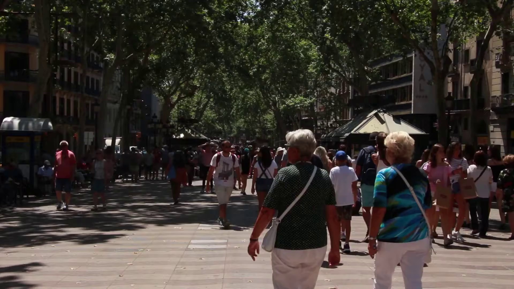

# Single-Pedestrian Video Tracker

A lightweight single-pedestrian tracker for crowded video scenes, built with **YOLOv8** detection and multi-cue matching (motion prediction + color histogram + NCC template verification). No tracker IDs or deep learning re-ID models required — it selects the best-matching person independently on every frame.



## Features

- **Per-frame detection**: Uses YOLOv8n for fast person detection on every frame.
- **Motion prediction**: Linear extrapolation from recent target positions to predict next location.
- **Color histogram matching**: 2D H-S histogram (Bhattacharyya distance) for appearance consistency.
- **NCC template verification** (`track.py`): Multi-scale normalized cross-correlation to reject false positives.
- **Lost-target recovery**: Dashed bounding box when target is temporarily lost; automatic re-acquisition.
- **Two variants**:
  - `track.py` — full pipeline with NCC verification (recommended).
  - `track_nocc.py` — lightweight version without NCC (faster, fewer dependencies).

## Quick Start

### 1. Clone & setup

```bash
git clone https://github.com/YOUR_USERNAME/single-pedestrian-tracker.git
cd single-pedestrian-tracker
python -m venv venv
source venv/bin/activate  # Windows: venv\Scripts\activate
pip install -r requirements.txt
```

> The YOLOv8n model (`yolov8n.pt`) will be **auto-downloaded** by `ultralytics` on the first run.

### 2. Prepare input video

Place your input video as `sample.mp4` in the project root. The first frame should show the target pedestrian in the lower-center region of the frame — the tracker auto-selects the best candidate based on position, size, and centrality.

### 3. Run

```bash
# Full version with NCC verification
python track.py

# Lightweight version without NCC
python track_nocc.py
```

Output videos (`result.mp4` / `result_nocc.mp4`) will be generated in the same folder.

## How It Works

| Stage | Method |
|-------|--------|
| **Detection** | YOLOv8n per-frame person detection |
| **Init** | Frame 0: select target by position (lower-center preference) + size score |
| **Prediction** | Linear velocity extrapolation from last 5 positions |
| **Scoring** | Combined score = position proximity + area consistency + color similarity |
| **Verification** (v7) | NCC multi-scale template matching to confirm the best candidate |
| **Update** | Exponential moving average on histogram; adaptive expected area |

## Project Structure

```
.
├── track.py          # Full tracker (YOLO + motion + color + NCC)
├── track_nocc.py     # Baseline tracker (YOLO + motion + color)
├── requirements.txt  # Python dependencies
├── first_frame.jpg   # Example: target auto-selection on frame 0
└── highlights.pdf    # Technical highlights & design rationale
```

## Dependencies

- Python ≥ 3.9
- [PyTorch](https://pytorch.org/) (with CUDA optional)
- [OpenCV](https://opencv.org/)
- [NumPy](https://numpy.org/)
- [Ultralytics](https://docs.ultralytics.com/)

See `requirements.txt` for pinned versions.

## Limitations

- Designed for **single-target** tracking in moderately crowded scenes.
- Target is fixed after frame 0 (no interactive re-selection mid-video).
- Assumes the target remains a "person" class throughout; occlusions longer than a few frames may cause drift.

## License

MIT License — see [LICENSE](LICENSE) for details.

## Acknowledgments

- Detection powered by [Ultralytics YOLOv8](https://github.com/ultralytics/ultralytics).
