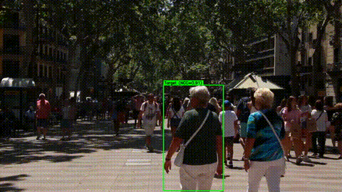

# 单行人视频追踪器

<div align="right">
  <a href="README.md">🇺🇸 English</a>
</div>

一款轻量级的单行人追踪器，适用于拥挤场景的视频。基于 **YOLOv8** 检测与多线索匹配（运动预测 + 颜色直方图 + NCC 模板验证）。无需追踪器 ID 或深度学习重识别模型 —— 每一帧都独立选出最匹配的行人。



## 特性

- **逐帧检测**：每帧使用 YOLOv8n 进行快速行人检测。
- **运动预测**：基于最近目标位置进行线性外推，预测下一位置。
- **颜色直方图匹配**：2D H-S 直方图（Bhattacharyya 距离）保证外观一致性。
- **NCC 模板验证**（`track.py`）：多尺度归一化互相关，剔除误检。
- **丢失目标恢复**：目标暂时丢失时显示虚线框，自动重新捕获。
- **两个版本**：
  - `track.py` —— 完整流程，带 NCC 验证（推荐）。
  - `track_nocc.py` —— 轻量版，无 NCC（更快、依赖更少）。

## 快速开始

### 1. 克隆与配置

```bash
git clone https://github.com/YOUR_USERNAME/single-pedestrian-tracker.git
cd single-pedestrian-tracker
python -m venv venv
source venv/bin/activate  # Windows: venv\Scripts\activate
pip install -r requirements.txt
```

> YOLOv8n 模型（`yolov8n.pt`）将在首次运行时由 `ultralytics` **自动下载**。

### 2. 输入视频

项目中已包含演示视频 `sample.mp4`。第一帧的目标行人位于画面中下区域 —— 追踪器会根据位置、大小和中心性自动选择最佳候选。

> 你也可以用自己的视频替换（保持文件名为 `sample.mp4`，或在脚本中修改 `video_path`）。

### 3. 运行

```bash
# 完整版本（带 NCC 验证）
python track.py

# 轻量版本（无 NCC）
python track_nocc.py
```

输出视频（`result.mp4` / `result_nocc.mp4`）将生成在同一文件夹中。

## 工作原理

| 阶段 | 方法 |
|------|------|
| **检测** | YOLOv8n 逐帧行人检测 |
| **初始化** | 第 0 帧：根据位置（偏好中下区域）+ 大小评分选择目标 |
| **预测** | 基于最近 5 个位置的线性速度外推 |
| **评分** | 综合评分 = 位置接近度 + 面积一致性 + 颜色相似度 |
| **验证**（v7）| NCC 多尺度模板匹配，确认最佳候选 |
| **更新** | 直方图指数移动平均；自适应期望面积 |

## 版本对比：`track.py` vs `track_nocc.py`

| | `track.py` | `track_nocc.py` |
|---|---|---|
| **NCC 验证** | ✅ 多尺度模板匹配 | ❌ 无 |
| **抗误检能力** | 高（NCC 阈值 ≥ 0.55） | 中等 |
| **运行速度** | 稍慢（模板金字塔 + NCC 搜索） | 更快 |
| **适用场景** | 拥挤场景、严重遮挡 | 干净背景、快速演示 |
| **推荐？** | ✅ 是 | 用于基线对比 |

## 项目结构

```
.
├── track.py          # 完整追踪器（YOLO + 运动 + 颜色 + NCC）
├── track_nocc.py     # 基线追踪器（YOLO + 运动 + 颜色）
├── sample.mp4        # 演示输入视频
├── requirements.txt  # Python 依赖
├── result.gif        # 演示：完整追踪结果（由 result.mp4 生成）
└── highlights.pdf    # 技术亮点与设计说明
```

## 依赖

- Python ≥ 3.9
- [PyTorch](https://pytorch.org/)（CUDA 可选）
- [OpenCV](https://opencv.org/)
- [NumPy](https://numpy.org/)
- [Ultralytics](https://docs.ultralytics.com/)

具体版本见 `requirements.txt`。

## 许可证

MIT 许可证 —— 详见 [LICENSE](LICENSE)。

## 致谢

- 检测模型由 [Ultralytics YOLOv8](https://github.com/ultralytics/ultralytics) 提供支持。
